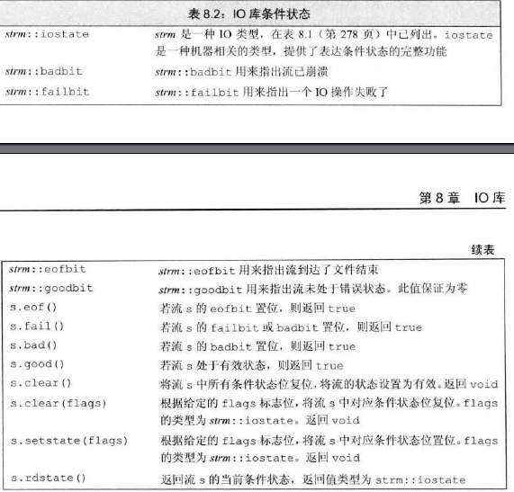
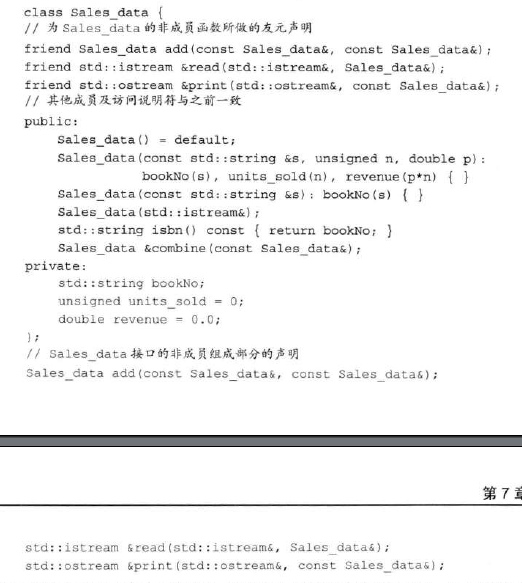
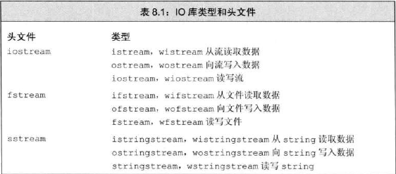

泛化的转义序列：

形式是，\x后紧跟1个或多个16进制数字或\后紧跟1个、2个或3个八进制数字。

ps：如果 \ 后面跟着的八进制数字超过3个，只有前三个与\构成转义序列；相反，\x要用到后面跟着的所有数字。


得到空指针最直接的方法就是用字面值**nullptr**来初始化指针


本身为常量叫顶层const,控制的基本类型部分为常量叫底层const

为了防止不小心改变数据，底层const可以不能赋值给非底层const对象（但是引用好像可以）

顶层const，如指针本身指向的地方不变，它本身的值可以被拷贝给不是顶层const的指针（指针指向的方向改变）

底层const，如指针指向的内容不变，指针本身的值不能被赋值给不是底层const的指针，这有可以有效防止不是底层const的指针随意篡改底层const指针守护的内容。


auto 一般会忽略掉顶层const,同时保留底层const。这意味着把顶层const对象如普通的一个常量，赋值会得到非顶层const的对象，一个变量。如果把控制某一块地方为const的底层const对象赋值，新变量所控制的那块地方仍然不能改变。

设置一个auto的引用时，初始值的顶层常量属性仍然保留。

 


如果定义变量时没有设置初始值，那么变量将被默认初始化（定义于函数体内的是例外）。类内的成员 默认初始化，但可以凭自己决定不初始化，且按照自己的想法按照给定的类内初始值进行初始化。


初始化：`=`实行的是拷贝初始化，如果不使用等号，如使用`()`，那么实行的是直接初始化。拷贝初始化就是把等号右边的初始值拷贝赋值给等号左边的对象。


vector 是模板而非类型，声明的时候尖括号里必须包括数据类型。这个类型不能是引用，因为引用不是一个对象。


{}花括号内的内容如果与要初始化的变量的数据类型一致，那么就是列表初始化；

```c++
vector<int> v1{1,2,3};  //列表初始化
```

如果不一致，它的用法就像圆括号一样

```c++
vector<string> v2{20};   //v2有20个默认初始化的元素
vector<string> v3{10,"hello"};  //v3有10个值为"hello"的元素
```


vector的empty和size两个成员返回值的类型是由vector定义的size_type类型。


有效的迭代器或者指向某个元素，或者指向容器中尾元素的下一位置。其他所有情况都属于无效。


begin 和 end 返回的具体类型由对象是否是常量决定，如果对象是常量，返回 const_iterator ，反之返回 iterator。 有时候我们只想读而不想对数据进行改动，cbegin() 与 cend()只返回 const_iterator 类型。


在函数内部定义的数组的默认初始化跟它的内置类型一样。比如在函数内部，string默认初始化为空字符串，string数组中的每个string都是空字符串；int默认是未定义的，int数组中的每个元素也是未定义的。


大多数表达式中，使用数组类型的变量往往被看作是在使用指向第一个元素的指针。decltype()不会发生这种转化。

```cpp
int a[] = {0,1,2,3,4,5,6,7,8,9};
auto ia2(ia);  //ia2为指针
decltype(ia) ia3;  //ia3为数组
```


数组arr，begin(arr) 返回 arr 首元素的指针；end(arr)返回 arr 尾元素下一位置的指针。


string对象转C风格字符串`const char *str = s.c_str();` ，函数的返回结果为`const char*`指针，指向的数组数据恰好与那个string对象的一样。后续对string对象的修改会使其失去效用，所以如果一直想用其返回的数组，最好将其重新拷贝一份。


使用数组初始化vector对象：

```cpp
int arr[]={0,1,2,3,4,5};
vector<int> ivec(begin(arr),end(arr));  //复制全部
vector<int> ivec(arr+1,arr+4);  //复制arr[1],arr[2],arr[3]
```


除法运算中，如果两个运算对象对象符号相同则为正，反之则为负，商向0取整。


 

递增和递减运算符有前置版本和后置版本。前置版本将对象本身作为左值返回，后置版本则将对象原始值的副本作为右值返回。 



sizeof(vec)只取决于vector里面存放的数据类型，与元素个数无关。


switch 的某一个case初始化了一个变量，如果这个变量后面在switch后面的作用域中还有用到，那么C++不允许跳过这个初始化语句。如果需要为某个 case 分支定义并初始化一个变量，应该把该变量定义在块内，以确保后面所有的case标签都在变量的作用域之外。


异常检测，使用throw 表达式表示引发了一个异常。throw 表达式包含关键字 throw 和紧随其后的一个表达式，其中表达式的类型就是抛出的异常类型。

```cpp
if (item.isbn()!=item2.isbn)
    throw runtime_error("Data must refer to same ISBN");
```

这里抛出了一个对象 runtime_error ，它是标准库异常类型的一种，我们用一个字符串作为辅助信息将它初始化了。


可以通过使用引用的方式避免拷贝，当函数无须改变引用形参的值，最好将其声明为常量引用。如果不是常量引用就无法接收const对象、字面值作为实参。


当函数形参数量多但是类型都相同时，可以使用 initializer_list 形参。


和vector一样，initializer_list 也是一种模板类型，<>尖括号里必须包含类型。不过它里面的值都是我们无法改变的常量值，当然这个特性同时也造就了它本身性能开销少的特点。如果你只需要表示一组常量值，例如初始化对象或函数参数，那么 `std::initializer_list` 是更合适的选择。而当你需要动态存储、访问和修改元素时，应该使用 `std::vector`。


对于函数形参来讲，顶层const和非顶层const没什么区别，毕竟最终赋给形参都变成了非顶层const。

但是底层const有区别，因为一个底层const不会在赋值给函数实参时被转化为非底层const。由于非const对象的引用或指向非const对象的指针能被转化为底层const,所以形参是底层const的函数也能接收它们，不过在有非常量版本的情况下，编译器会优先选择非常量版本的函数。


函数匹配（又叫重载确定）是指将调用的函数与一组重载函数中的特定一个相对应起来的过程，编译器通过将实参和重载集合中各个函数接受的形参进行比较，决定到底要调用那个函数。


一般来说，将函数的声明放在局部作用域里并不是一个聪明的选择。在C++中，名字查找发生在类型检查之前，一旦在当前作用域内找到了所需的名字，编译器就会忽略掉外层作用域中的同名实体。于是看不到外面的那些函数了，这会造成外层重载的函数无法使用的后果。


constexpr 函数是指那些可以被作为常量表达式的函数。这种函数的形参和返回值必须都是字面值类型，并且有且只有一条 return语句。

函数体内可以不只有一条语句，但那些多出来的语句必须在运行中不执行任何操作。比如说空语句、类型别名以及using 声明。

编译时，编译器可能会隐式地将它作为内联函数展开。

注意：constexpr函数不一定返回常量表达式，当将它用在需要常量表达式的上下文中，编译器会检查，如果恰好不是常量表达式，编译器会报错。


预处理器定义了5个对程序调试很有用的名字：

\_\_func__ 输出当前调试的函数的名字

\_\_FILE__ 存放文件名的字符串字面值

\_\_LINE__存放当前行号的整型字面值

\_\_TIME__存放文件编译时间的字符串字面值

_\_DATE__ 存放文件编译日期的字符串字面值


使用函数名作为一个值使用时会自动转化为指针。

可以直接使用函数指针调用函数，无须解引用。

可以用类型别名和decltype()简化使用函数指针的代码。但是要注意decltype()中如果是函数，不会自动转化为函数指针。

和函数类型的形参不一样，返回类型不会自动地转换成指针。


定义在类内部的函数默认是隐式的inline函数（视情况而定，如果太长了编译器就不会把它当作内联函数）


调用成员函数时会隐式地将调用它的对象地址赋给隐式形参`this`。我们可以直接在成员函数里使用调用该函数的对象的成员，实际上，对任何类成员的直接访问都被看作对`this`的隐式引用。


`this`默认下为顶层const、非底层const，这意味着我们将无法调用一个常量对象的成员函数（因为调用它时会隐式给形参`this`赋值，但是我们不能把 一个常量赋给指向非常量的指针）。我们可以在形参列表后面加const改变这一现状，这将把`this`当作是指向const的指针。

例如：`std::string isbn() const {return bookNo;}`


函数可以允许其他非成员函数访问非公有成员，方法是在类里将它设为友元。这只需要在类中（只能在类定义的内部，但具体位置不限）的函数声明语句中以friend开头即可。一般来说，最好在类定义开始或结束前的位置集中声明友元。




类的声明和定义可以分离。暂先不定义而分离在前面的声明叫做前向声明。在完成定义前，这个类型称为不完全类型。我们可以创建对它的指针和引用，也可以声明（但不能定义）以不完全类型作为参数或者返回类型的函数。但是不能创建对象，也不能用指针或引用访问它的成员，因为还未定义，编译器不知道成员在哪里。

基于这个原理，类的定义不能包含自己，但是可以包含对自己的指针和引用。因为前面的那部分就算声明过了。

```cpp
class Link_screen{
    Screen window;
    Link_screen *next;
    Link_screen *prev;
};
```


可以单令类中的某个成员函数为友元。

```cpp
class Screen{
    friend void Window_mgr::clear(ScreenIndex);
};
```

假设类1要类2中的成员函数为它的友元，

遵循一定顺序组织程序：

1. 先定义类2，其中声明但不要定义那个要被设为友元的函数（那个函数中要用类1的东西，所以你暂时也定义不来对吧）。
2. 定义类1，声明类2的那个成员函数是我的朋友（友元）。
3. 定义那个要被当作友元的成员函数。


尽管重载函数的名字相同，它们依然是不同的函数。想要把一组重载函数声明为友元需要对这组函数的每一个分别声明。


假设"它"是要作为友元的类或非成员函数。

友元仅仅指定了访问权限，而非一个真正意义上的函数声明。所以如果仅在类内友元声明过，类内的其他函数依然无法使用它，要真正使用它，还需要在外部另外声明从而使得其可见。不过我们不必因此非要在友元声明前声明它，因为当一个名字第一次出现在一个友元声明中时，我们隐式地假定该名字在当前作用域中是可见的。


一旦遇到了类名，定义的剩余部分就在类的作用域内了，比如参数列表和函数体。函数的返回类型通常出现在函数名之前，所以当成员函数定义在类的外部时，返回类型中使用的名字都位于类的作用域之外。

外部定义时，要显式指定返回类型是哪个类里的：

```cpp
Window_mgr::ScreenIndex  Window_mgr::addScreen(const Screen &s)
{
    screens.push_back(s);
    return screens.size()-1;
}
```


类的定义分两步处理：

1. 编译成员的声明
2. 类全部可见后编译函数体

所以函数体内使用的参数可以是包括在它之后的类内所有成员声明。

类内的成员声明使用的名字，如果类内没有就会向定义它的上级定义域找。C++不能在外层作用域定义了某种类型的情况下于内层重新定义它（即使定义的类型相同也不可以），我猜测是因为如果允许的话，在重新定义的声明前，某个名字是这个定义，重新定义后又是另一个定义，这很容易搞混。

当成员定义在类的外部时，还要考虑成员函数定义之前的全局作用域的声明。


如果成员是const、引用，或者属于某种未提供默认构造函数的类类型，我们必须通过构造函数初始值列表为这些成员提供初值。

 

成员初始化的顺序与它在类定义中的出现的顺序有关，而与初始化列表中的前后位置无关。


如果一个构造函数为所有参数都提供了默认实参，则它实际上也定义了默认构造函数。


接受一个容量参数的vector构造函数是explicit 的。


聚合类使得用户可以直接访问其成员，并且具有特殊的初始化语法形式。

当一个类满足如下条件时，我们说它是聚合的：

- 所有成员都是public的
- 没有定义任何构造函数
- 没有类内初始值
- 没有基类，也没有virtual参数

可以通过提供一个花括号括起来的成员初始值列表来初始化聚合类的数据成员

```cpp
Data val1={0,"Anna"};
```

与初始化数组的规则一样，如果初始值列表中的元素个数少于类的成员数量，则靠后的成员被值初始化。


字面值类型的类可能含有constexpr函数成员，它们是隐式const成员函数。（字面值类型接收this，this需要是const的）

数据成员都是字面值类型的聚合类是字面值常量类。

如果一个类不是聚合类，符合以下要求也是一个字面值常量类：

- 数据成员都必须是字面值类型
- 类必须至少有一个constexpr构造函数
- 如果一个数据成员含有类内初始值，则内置类型成员的初始值必须是一条常量表达式；如果成员属于某种类类型，则初始值必须使用成员自己的constexpr构造函数
- 类必须使用析构函数的默认定义，该成员负责销毁类的定义


在成员的声明之前加上关键字 static 使其与类关联在一起。

类的静态成员超脱于任何一个对象，每个对象都不含有任何与静态成员有关的数据。

类似的，静态成员函数与单个对象无关，它不包含this指针。作为结果，它不能是const的，也不能在static函数体内使用this，无论是显式使用，还是调用非静态成员（隐式使用）。




IO对象无法被拷贝或复制，所以不能将形参或者返回类型设置为流类型，进行 IO 操作的函数通常以引用方式传递和返回流。


流应用过程中可能发生错误。一些函数和标志可以帮助我们访问和操作流的条件状态。


只有无错的流才能继续读入，可以以下面的方式读入：

```c
while (cin >> word)
    // ok: 读操作成功
```

