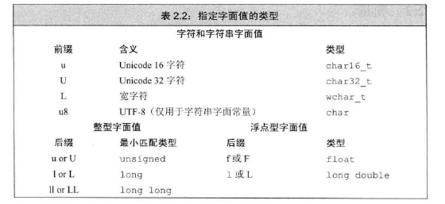
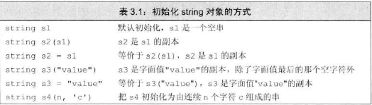
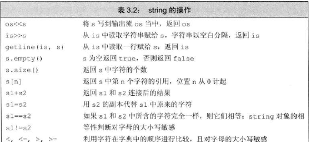
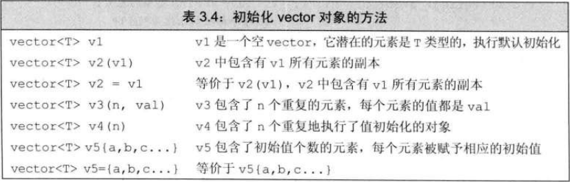
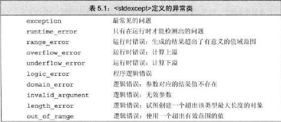
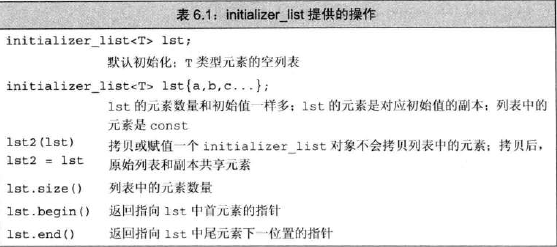

泛化的转义序列：

形式是，\x后紧跟1个或多个16进制数字或\后紧跟1个、2个或3个八进制数字。

ps：如果 \ 后面跟着的八进制数字超过3个，只有前三个与\构成转义序列；相反，\x要用到后面跟着的所有数字。



得到空指针最直接的方法就是用字面值**nullptr**来初始化指针


用常量表达式初始化const对象后，编译器在编译过程中把文件中的每个变量都替换为对应的值。如果一个程序中在多个文件中都含有const对象，每个用了const对象的文件，编译器都必须知道初始值是什么，所以每个文件都必须定义这个const对象。为了避免对同一变量的重复定义，const对象被设定为仅在文件内有效。

如果想在多个文件中共享const变量，必须在变量的定义之前添加extern关键字。


不能给引用赋其他类型的值或者一个表达式，除非前面用const。因为表达式最后的结果是一个临时量，一般来说定义一个引用就是想通过引用改变它的值，但是大家一般不会想改变临时量，也就不会想着把引用绑定到临时量上。所以C++规定这种行为是非法的。赋其他类型的值也是同理。赋其他类型的值的过程中其实是在进行类型强制转化，也可以算作表达式。

对const的引用也称为常量引用，不能通过它改变它所引用的对象。


本身为常量叫顶层const,控制的基本类型部分为常量叫底层const

为了防止不小心改变数据，底层const可以不能赋值给非底层const对象（但是引用好像可以）

顶层const，如指针本身指向的地方不变，它本身的值可以被拷贝给不是顶层const的指针（指针指向的方向改变）

底层const，如指针指向的内容不变，指针本身的值不能被赋值给不是底层const的指针，这有可以有效防止不是底层const的指针随意篡改底层const指针守护的内容。


auto 一般会忽略掉顶层const,同时保留底层const。这意味着把顶层const对象如普通的一个常量，赋值会得到非顶层const的对象，一个变量。如果把控制某一块地方为const的底层const对象赋值，新变量所控制的那块地方仍然不能改变。

设置一个auto的引用时，初始值的顶层常量属性仍然保留。


如果定义变量时没有设置初始值，那么变量将被默认初始化（定义于函数体内的是例外）。类内的成员 默认初始化，但可以凭自己决定不初始化，且按照自己的想法按照给定的类内初始值进行初始化。




初始化：`=`实行的是拷贝初始化，如果不使用等号，如使用`()`，那么实行的是直接初始化。拷贝初始化就是把等号右边的初始值拷贝赋值给等号左边的对象。





getline(输入流,string对象) 从给定输入流读取字符串，直到遇到换行符，它读取换行符但是不将其存入string对象。此函数最后返回流参数。

string.empty()返回是否为空。

string.size()返回string对象中字符的个数。返回类型为string::size_type,一个无符号整型数，它保证它能存放无论字符串多长的字符串。

string 可以使用加法。可以加字面量或者是字符常量。但 + 两边至少有一个运算对象是string。

注意字符串字面值并非标准库类型string的对象。还有，像下面的语句是对的（每个加法运算符都有一个运算对象是 string)

```c++
string s1 = "hello, ";
string s = s1 + "， " + "world";
```


vector 是模板而非类型，声明的时候尖括号里必须包括数据类型。这个类型不能是引用，因为引用不是一个对象。



{}花括号内的内容如果与要初始化的变量的数据类型一致，那么就是列表初始化；

```c++
vector<int> v1{1,2,3};  //列表初始化
```

如果不一致，它的用法就像圆括号一样

```c++
vector<string> v2{20};   //v2有20个默认初始化的元素
vector<string> v3{10,"hello"};  //v3有10个值为"hello"的元素
```


vector的empty和size两个成员返回值的类型是由vector定义的size_type类型。


有效的迭代器或者指向某个元素，或者指向容器中尾元素的下一位置。其他所有情况都属于无效。

如果容器为空，则begin和end返回的都是尾后迭代器。


一般来说，我们并不关心迭代器的精确类型。事实上，那些拥有迭代器的标准库类型使用 iterator 和 const_iterator 来表示迭代器的类型。

const_iterator像const指针一样，能访问上面的值但是不能改动内容。


begin 和 end 返回的具体类型由对象是否是常量决定，如果对象是常量，返回 const_iterator ，反之返回 iterator。 有时候我们只想读而不想对数据进行改动，cbegin() 与 cend()只返回 const_iterator 类型。


在函数内部定义的数组的默认初始化跟它的内置类型一样。比如在函数内部，string默认初始化为空字符串，string数组中的每个string都是空字符串；int默认是未定义的，int数组中的每个元素也是未定义的。


大多数表达式中，使用数组类型的变量往往被看作是在使用指向第一个元素的指针。decltype()不会发生这种转化。

```cpp
int a[] = {0,1,2,3,4,5,6,7,8,9};
auto ia2(ia);  //ia2为指针
decltype(ia) ia3;  //ia3为数组
```


数组arr，begin(arr) 返回 arr 首元素的指针；end(arr)返回 arr 尾元素下一位置的指针。


标准库类型（如string、vector）的下标是unsigned类型所以必须是正的。而数组的下标可以是负的，只要指向的元素确实存在或者是数组尾元素的下一位置即可。


string对象转C风格字符串`const char *str = s.c_str();` ，函数的返回结果为`const char*`指针，指向的数组数据恰好与那个string对象的一样。后续对string对象的修改会使其失去效用，所以如果一直想用其返回的数组，最好将其重新拷贝一份。


使用数组初始化vector对象：

```cpp
int arr[]={0,1,2,3,4,5};
vector<int> ivec(begin(arr),end(arr));  //复制全部
vector<int> ivec(arr+1,arr+4);  //复制arr[1],arr[2],arr[3]
```


注意以下的代码第一行&row为引用，为什么将其作为引用呢？

```cpp
for (const auto &row:ia)
    for (auto col:row)
```

因为，如果非引用，第二行的row会被当作一个指针看待，然后出错。要使用范围 for 语句 处理多维数组，除了最内层的循环外，其他所有循环的控制变量都应该是引用类型。


除法运算中，如果两个运算对象对象符号相同则为正，反之则为负，商向0取整。


 

递增和递减运算符有前置版本和后置版本。前置版本将对象本身作为左值返回，后置版本则将对象原始值的副本作为右值返回。 


右移运算符的运算对象如果是无符号类型，在左侧插入 0 的二进制位；如果该运算对象是带符号类型，在左侧插入符号位的副本或值为0的二进制位。


移位运算符的优先级比算术运算符低，但比关系运算符、赋值运算符和条件运算符的优先级高。


sizeof(vec)只取决于vector里面存放的数据类型，与元素个数无关。


switch 的某一个case初始化了一个变量，如果这个变量后面在switch后面的作用域中还有用到，那么C++不允许跳过这个初始化语句。如果需要为某个 case 分支定义并初始化一个变量，应该把该变量定义在块内，以确保后面所有的case标签都在变量的作用域之外。


异常检测，使用throw 表达式表示引发了一个异常。throw 表达式包含关键字 throw 和紧随其后的一个表达式，其中表达式的类型就是抛出的异常类型。

```cpp
if (item.isbn()!=item2.isbn)
    throw runtime_error("Data must refer to same ISBN");
```

这里抛出了一个对象 runtime_error ，它是标准库异常类型的一种，我们用一个字符串作为辅助信息将它初始化了。


异常处理 try语句块

```cpp
try{
    program-statements
}catch (exception-declaration){
    handler-statements
}catch (exception-declaraion){
    handler-statments
}
```

当选中完一个catch语句处理完异常后，会自动跳转到最后一个catch语句的后面。

一个示例代码：

```cpp
while(cin >> item1 >> item2){
    try {
        //执行添加两个 Sales_item 对象的代码
        //如果添加失败
        throw runtime_error("failed");
    }catch (runtime_error err){
        cout<< err.what() <<endl;
        char c;
        cin >> c;
        if (!cin || c=='n')
            break;
    }
}
```

如果try一层套一层，那么就会先在抛出异常的那层找相应的catch，没找到就在它的上一层找，知道找到适当类型的catch为止。

如果一直找到最后都没有找到，那么程序会转到名为 terminate 的标准库函数，这会导致当前程序终止。

异常类分别定义在4个头文件中

- exception 头文件定义了最通用的异常类 exception。它只报告异常的产生，不提供额外信息。
- stdexcept 头文件定义了几种常用的异常类
- new 头文件定义了bad_alloc 异常类型
- type_info 头文件定义了 bad_cast 异常类型




可以通过使用引用的方式避免拷贝，当函数无须改变引用形参的值，最好将其声明为常量引用。如果不是常量引用就无法接收const对象、字面值作为实参。


当函数形参数量多但是类型都相同时，可以使用 initializer_list 形参。



和vector一样，initializer_list 也是一种模板类型，<>尖括号里必须包含类型。不过它里面的值都是我们无法改变的常量值，当然这个特性同时也造就了它本身性能开销少的特点。如果你只需要表示一组常量值，例如初始化对象或函数参数，那么 `std::initializer_list` 是更合适的选择。而当你需要动态存储、访问和修改元素时，应该使用 `std::vector`。


函数的返回类型决定函数调用是否为左值。调用一个返回类型是引用的函数得到左值，其他返回类型得到右值。


尾置返回：上面的函数声明等价于`auto func(int i) -> int(*)[10];`为了将函数返回的类型后置，我们在本应该出现返回类型的地方放置一个 `auto`。


```cpp
int odd[]={1,3,5,7};
decltype(odd) *arrPtr(int i){
    /*something*/
}
```

这里decltype(odd)不会自动将数组类型转换成对应的指针，所以要在函数声明时加一个`*`符号。


函数可以名字相同但是形参列表不同，这样的函数往往想要拥有能根据不同的输入达成相同的目标的能力。

函数不能其他都相同，惟有返回值不相同。


对于函数形参来讲，顶层const和非顶层const没什么区别，毕竟最终赋给形参都变成了非顶层const。

但是底层const有区别，因为一个底层const不会在赋值给函数实参时被转化为非底层const。由于非const对象的引用或指向非const对象的指针能被转化为底层const,所以形参是底层const的函数也能接收它们，不过在有非常量版本的情况下，编译器会优先选择非常量版本的函数。


函数匹配（又叫重载确定）是指将调用的函数与一组重载函数中的特定一个相对应起来的过程，编译器通过将实参和重载集合中各个函数接受的形参进行比较，决定到底要调用那个函数。


一般来说，将函数的声明放在局部作用域里并不是一个聪明的选择。在C++中，名字查找发生在类型检查之前，一旦在当前作用域内找到了所需的名字，编译器就会忽略掉外层作用域中的同名实体。于是看不到外面的那些函数了，这会造成外层重载的函数无法使用的后果。


很多时候函数的某些形参总是被赋予相同的值，我们可以把这些参数设置为默认值。这个设置的默认值称为函数的默认实参。要注意的是，如果某一个设置了默认值，那么它右边所有的全部都要设置默认值。

```cpp
typedef string::size_type sz;
string screen(sz ht=24,sz wid=80,char backgrnd=' ');  //设置默认实参
```

调用含有默认实参的函数时，可以包含该实参也可以将其省略。函数赋值跟位置顺序有关，所以如果你想改变右边的形参就必须给左边的形参赋相应的实参。基于这个原因，最好把常用的默认值放在右边，经常需要修改的默认值放在左边。

```cpp
string screen(sz ht=24,sz wid=80,char backgnd='?'); //想改最右边的要把前面的都赋一遍值，不管是不是默认值
```

多次声明同一个函数是合法的，但是需要注意在给定的作用域内一个形参只能被赋予一次默认值。后续声明要添加默认值是要保证右边的都是有默认值的。

```cpp
string screen(sz,sz,char=' ');
string screen(sz,sz,char='*');  //错误，重复声明不能修改已经存在的默认值
string screen(sz=24,sz=80,char);  //正确
```

局部变量不能作为默认实参。

```cpp
sz wd=80;
char def=' ';
sz ht();
string screen(sz=ht(),sz=wd,char = def);

void f2()
{
    def='*'; //改变原来声明的def的值
    sz wd = 100;  //在函数内部声明了一个新的wd,隐藏了外部的wd，没有改变默认值
    window = screen();  //调用 screen(ht(),80,'*')
}
```


小函数前面加 inline 表示向编译器申请在调用时内联展开(将函数调用替换为函数本体），这样可以避免函数调用时压栈、跳转等开销，从而提高程序的性能。

```cpp
inline const string&
shorterString(const string &s1,const string &s2)
{
    return s1.size()<=s2.size()?s1:s2;
}
```

constexpr 函数是指那些可以被作为常量表达式的函数。这种函数的形参和返回值必须都是字面值类型，并且有且只有一条 return语句。

函数体内可以不只有一条语句，但那些多出来的语句必须在运行中不执行任何操作。比如说空语句、类型别名以及using 声明。

编译时，编译器可能会隐式地将它作为内联函数展开。

注意：constexpr函数不一定返回常量表达式，当将它用在需要常量表达式的上下文中，编译器会检查，如果恰好不是常量表达式，编译器会报错。


有选择地调试代码可以用assert()，assert里面是条件式，如果是真的就输出信息并终止程序的执行。assert()是一个宏，定义在cassert头文件中，在编译之前由预处理器处理。

如果定义了NDEBUG关闭调试状态，assert()语句将什么也不做，关闭运行时检查。

你可以在程序里`#define NDEBUG`，当然很多编辑器允许你命令行进行输入

```shell
$ CC -D NDEBUG main.C
```

这可以达到同样的效果。


预处理器定义了5个对程序调试很有用的名字：

\_\_func__ 输出当前调试的函数的名字

\_\_FILE__ 存放文件名的字符串字面值

\_\_LINE__存放当前行号的整型字面值

\_\_TIME__存放文件编译时间的字符串字面值

_\_DATE__ 存放文件编译日期的字符串字面值


函数匹配

**第一步：选定对应的重载函数集，集合中的函数称为候选函数。**

1.名字相同

2.声明在相同的作用域内

**第二步：筛选，通过这一步的函数晋升为可行函数**

1.形参和提供的实参个数相同

2.实参本来就是或者可以被转换为形参的类型

> note:如果函数含有默认实参，我们在调用它时传入的实参数量可能少于它实际使用的实参数量

**第三步：寻找最佳匹配**

核心：转化越少越好

- 每个实参的匹配都不劣于其他函数
- 至少有一个优于其他函数

如果有找不到这么的一个函数脱颖而出，就称调用有两义性，调用失败。


为了确定最佳匹配，编译器将转换划分了等级

1.精准匹配

- 实参和形参类型相同
- 增加或者删除一个顶层const
- 数组或函数类型转化为对应的指针

2.const转换（非底层const -> 底层const）

3.类型提升（如int -> long long)

4.算术类型改变或指针转换

5.通过类类型转换实现的匹配


使用函数名作为一个值使用时会自动转化为指针。

可以直接使用函数指针调用函数，无须解引用。

可以用类型别名和decltype()简化使用函数指针的代码。但是要注意decltype()中如果是函数，不会自动转化为函数指针。

和函数类型的形参不一样，返回类型不会自动地转换成指针。

